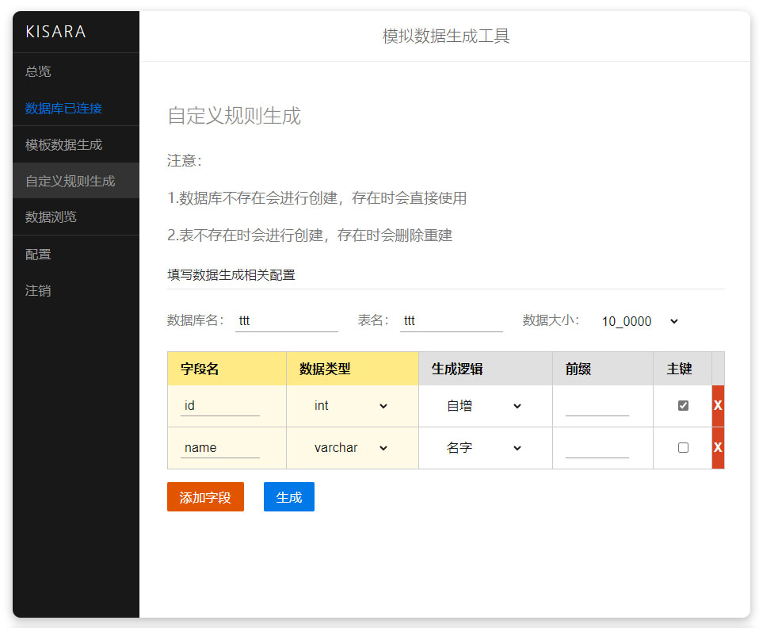

# KISARA

数据库模拟数据生成工具

### 数据类型

#### int

- [x] 仅前缀 
- [x] 自增
- [ ] 雪花算法

#### double

- [x] 分数(100)

- [x] 体重

  

#### varchar

- [x] 仅前缀
- [x] UUID
- [x] NanoID
- [x] 名字
- [x] email
- [x] 手机号
- [ ] 描述生成
- [ ] 随机规制词

#### 日期时间

##### date

- [x] 当前时间
- [x] 随机时间

##### datetime

- [ ] 当前日期+时间
- [ ] 随机日期+时间

##### timestamp

- [ ] 当前时间戳
- [ ] 随机时间戳

#### ...

## 更新历史

- v0.0.1 20220626
  - 完成前端页面及后端基本框架
  - 完成 [名字]，[手机号]，[仅前缀] 数据生成
  - 拟发布第一版，已拥有基础功能
- v0.1.1 20220627
  - 补充复合主键
  - 完成 [仅前缀]，[UUID]，[NanoID]，[email] 数据生成
  - 优化 SQL 字符串拼接
- v0.2.1 20220628
  - 前后端整合，已可以基本正常使用
- v0.2.2 20220629
  - 修复双自增问题
  - 修复CSS 引用问题

